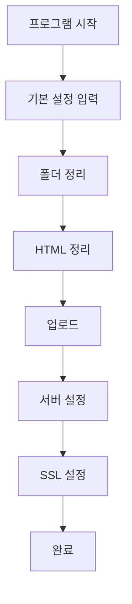

# 📖 Site Creator 사용자 메뉴얼

**웹사이트 자동 배포 도구 사용법 (Windows 전용)**

## 🎯 목차

1. [시작하기](#시작하기)
2. [Windows 설치 가이드](#windows-설치-가이드)
3. [프로그램 실행](#프로그램-실행)
4. [기본 설정](#기본-설정)
5. [작업 순서](#작업-순서)
6. [상세 작업 가이드](#상세-작업-가이드)
7. [문제 해결](#문제-해결)
8. [팁과 모범 사례](#팁과-모범-사례)

---

## 🚀 시작하기

### 시스템 요구사항

- **운영체제**: **Windows 10/11 (권장)**
- **Python**: **Python 3.13 이상 (권장)**, 3.9+ (최소)
- **메모리**: 최소 4GB RAM
- **저장공간**: 최소 2GB 여유 공간
- **권한**: 관리자 권한 (설치 시)

### 사전 준비사항

1. **도메인**: 배포할 웹사이트의 도메인 주소
2. **서버 정보**: 원격 서버의 IP 주소와 root 비밀번호
3. **템플릿 파일**: 배포할 웹사이트 템플릿 폴더
4. **SSL 인증서**: Let's Encrypt 사용 (자동 설정)

### 🚨 서버 사전 점검 목록 (중요!)

서버 설정 전에 다음 사항들을 확인하세요:

#### 1. **기존 서비스 충돌 확인**
```bash
# 포트 5000 사용 중인 프로세스 확인
sudo netstat -tlnp | grep :5000
sudo lsof -i :5000

# 기존 Flask 서비스 확인
sudo systemctl list-units --type=service | grep flask
```

#### 2. **Python 환경 확인**
```bash
# Python 버전 확인 (3.6 이상 권장)
python3 --version

# pip 버전 확인
python3 -m pip --version
```

#### 3. **시스템 리소스 확인**
```bash
# 디스크 공간 확인 (최소 2GB 여유 공간 필요)
df -h /root/

# 메모리 확인
free -h
```

#### 4. **기존 nginx 설정 확인**
```bash
# nginx 설정 파일 확인
sudo nginx -t
ls -la /etc/nginx/sites-enabled/
```

#### 5. **방화벽 설정 확인**
```bash
# UFW 상태 확인
sudo ufw status
```

---

## 🪟 Windows 설치 가이드

### 1단계: Python 3.13 설치

#### 방법 1: 공식 웹사이트에서 다운로드 (권장)
1. [Python 공식 웹사이트](https://www.python.org/downloads/) 방문
2. **Python 3.13.x** 다운로드 (최신 안정 버전)
3. 설치 시 **"Add Python to PATH"** 체크박스 반드시 선택 ✅
4. **"Install for all users"** 선택 (관리자 권한 필요)

#### 방법 2: Microsoft Store에서 설치
1. Windows 시작 메뉴에서 **"Microsoft Store"** 검색
2. **"Python 3.13"** 검색 후 설치
3. 자동으로 PATH에 추가됨

#### 설치 확인
```cmd
# 명령 프롬프트에서 확인
python --version
# 출력: Python 3.13.x

# 또는
python3 --version
```

### 2단계: 프로젝트 다운로드

```cmd
# 원하는 폴더로 이동 (예: C:\Projects)
cd C:\Projects

# Git으로 프로젝트 클론
git clone <repository-url>
cd site_creator

# 또는 ZIP 파일 다운로드 후 압축 해제
```

### 3단계: 자동 환경 설정 (권장)

#### 🚀 Python 3.13 자동 설정
```cmd
# 관리자 권한으로 명령 프롬프트 실행
# 프로젝트 폴더에서
setup_python313.bat
```

이 스크립트는 다음을 자동으로 수행합니다:
- ✅ Python 3.13 버전 확인
- ✅ 기존 가상환경 백업
- ✅ Python 3.13 가상환경 생성
- ✅ 모든 필수 패키지 설치
- ✅ 호환성 검사

#### 🔧 기존 설치 방법
```cmd
# 기존 Python 버전 사용 시
setup.bat
```

### 4단계: 수동 환경 설정 (선택사항)

```cmd
# 가상환경 생성
python -m venv venv

# 가상환경 활성화
venv\Scripts\activate

# pip 업그레이드
python -m pip install --upgrade pip

# 의존성 설치
pip install -r requirements.txt
```

---

## 🖥️ 프로그램 실행

### 1단계: 가상환경 활성화

```cmd
# 프로젝트 폴더에서
venv\Scripts\activate

# 성공 시 프롬프트 앞에 (venv) 표시됨
(venv) C:\Projects\site_creator>
```

### 2단계: Python 3.13 호환성 확인

```cmd
# 호환성 검사 실행
python check_python_version.py
```

**검사 항목:**
- ✅ Python 3.13+ 버전 확인
- ✅ 필수 패키지 설치 상태
- ✅ PyInstaller 6.0.0+ 호환성
- 🔧 문제 발생 시 해결 방법 안내

### 3단계: GUI 실행

```cmd
# PyQt5 기반 GUI 실행
python ui.py
```

### 4단계: GUI 확인

프로그램이 실행되면 다음 요소들이 표시됩니다:

- **제목**: "Site Creator - 웹사이트 자동 배포 도구"
- **운영체제 정보**: "운영체제: Windows" 표시
- **설정 정보 섹션**: 6개의 입력 필드
- **작업 실행 섹션**: 8개의 기능 버튼
- **상태바**: 현재 작업 상태 표시

---

## ⚙️ 기본 설정

### 입력 필드 설명

| 필드명 | 설명 | 예시 |
|--------|------|------|
| **도메인** | 배포할 웹사이트 도메인 | `example.com` |
| **링크** | 블랙리스트 링크 (선택사항) | `https://example.com/black` |
| **서버 IP** | 원격 서버 IP 주소 | `192.168.1.100` |
| **서버 PW** | 서버 root 비밀번호 | `your_password` |
| **Template** | 로컬 템플릿 폴더 경로 | `C:\Users\username\template` |
| **블랙 파일** | 블랙리스트 파일 경로 (선택사항) | `C:\Users\username\blacklist.txt` |

### 기본값 설정

프로그램 시작 시 다음 기본값이 자동으로 설정됩니다:

- 도메인: `example.com`
- 서버 IP: `192.168.1.100`
- 서버 PW: `password123`
- Template: `C:\Users\username\template`
- 블랙 파일: `C:\Users\username\blacklist.txt`

> 💡 **Windows 경로 형식**: 모든 경로는 백슬래시(`\`) 또는 슬래시(`/`) 사용 가능

---

## 🔄 작업 순서

### 전체 워크플로우



### 권장 작업 순서

1. **🔍 서버 점검** → 2. **📁 폴더 정리** → 3. **🔧 HTML 정리** → 4. **📤 업로드** → 5. **⚙️ 서버 설정** → 6. **🔒 SSL 설정**

> 💡 **권장사항**: 서버 설정 전에 반드시 "서버 점검" 버튼을 먼저 실행하세요!

---

## 📋 상세 작업 가이드

### 1️⃣ 서버 점검 (새로 추가!)

**목적**: 서버 설정 전에 시스템 상태를 점검하여 문제를 미리 발견

**사전 준비**:
- 서버 IP 및 비밀번호 입력

**실행 방법**:
1. 서버 IP와 서버 PW 필드에 정보 입력
2. "서버 점검" 버튼 클릭
3. 점검 결과 확인

**점검 항목**:
- ✅ Python 버전 확인 (3.6 이상 권장)
- ✅ 포트 5000 사용 현황 확인
- ✅ 기존 Flask 서비스 확인
- ✅ 디스크 공간 확인 (최소 2GB 여유)
- ✅ 메모리 상태 확인
- ✅ nginx 설정 확인
- ✅ UFW 방화벽 상태 확인

**점검 결과**:
- **정상**: 모든 항목이 정상이면 "✅ 모든 점검 항목이 정상입니다!" 메시지
- **경고**: 일부 경고사항이 있으면 사용자에게 확인 요청
- **오류**: 심각한 문제가 있으면 서버 설정 중단 권장

**주의사항**:
- 서버 점검은 서버 설정 전에 반드시 실행하세요
- 경고사항이 있어도 계속 진행할 수 있습니다
- 오류가 있으면 문제를 해결한 후 다시 점검하세요

### 2️⃣ 폴더 정리

**목적**: 템플릿 폴더를 정리하고 압축하여 배포 준비

**사전 준비**:
- Template 필드에 템플릿 폴더 경로 입력
- 템플릿 폴더에 `white.html`과 `static` 폴더 존재 확인

**실행 방법**:
1. Template 필드에 경로 입력 또는 Browse 버튼으로 선택
2. "폴더 정리" 버튼 클릭
3. 성공 메시지 확인

**결과**:
- `static.zip` 파일 생성
- 폴더 구조 최적화
- 배포 준비 완료

**주의사항**:
- 기존 `white.html`이 있다면 "이미 진행 완료" 메시지 표시
- 템플릿 폴더 경로가 올바른지 확인

### 3️⃣ HTML 정리

**목적**: HTML 파일 최적화 및 템플릿 변수 처리

**사전 준비**:
- 폴더 정리 완료
- `white.html` 파일 존재

**실행 방법**:
1. "HTML 정리" 버튼 클릭
2. 처리 완료 메시지 확인

**처리 내용**:
- HTML 주석 제거
- 템플릿 변수 처리 (`{{ }}`)
- 상대 경로를 Flask 템플릿 경로로 변환
- "Free Version", "Free Demo" 텍스트 제거

**결과**:
- 최적화된 HTML 파일
- Flask 템플릿 호환성 확보

### 4️⃣ 업로드

**목적**: 정리된 파일들을 원격 서버에 업로드

**사전 준비**:
- 폴더 정리 및 HTML 정리 완료
- 서버 IP 및 비밀번호 입력
- 도메인 입력

**실행 방법**:
1. 모든 필수 필드 입력 확인
2. "업로드" 버튼 클릭
3. 업로드 진행 상황 모니터링

**업로드되는 파일들**:
- `page_default/` 폴더 전체
- `white.html`
- `static.zip`

**결과**:
- 서버에 모든 파일 업로드 완료
- Flask 애플리케이션 준비

### 5️⃣ 서버 설정 (자동 점검 포함)

**목적**: nginx 및 Flask 애플리케이션 자동 설정

**사전 준비**:
- 업로드 완료
- 서버 정보 입력 완료

**실행 방법**:
1. "서버 설정" 버튼 클릭
2. **자동 점검**: 서버 상태 자동 점검 (Python, 포트, 디스크 등)
3. **자동 정리**: 기존 서비스 정리 (필요시)
4. **서버 설정**: nginx 및 Flask 설정
5. **검증**: 서비스 상태 확인
6. 완료 메시지 확인

> 🆕 **새로운 기능**: 서버 설정 버튼을 클릭하면 자동으로 서버 점검부터 검증까지 모든 과정이 순차적으로 실행됩니다!

**자동 설정 내용**:
- nginx 설정 파일 생성
- Flask 애플리케이션 설정
- 시스템 서비스 등록
- 방화벽 설정
- 권한 설정

**결과**:
- 웹사이트 접속 가능
- HTTP 서비스 시작

### 6️⃣ SSL 설정

**목적**: HTTPS 보안 연결 설정

**사전 준비**:
- 서버 설정 완료
- 도메인 DNS 설정 완료
- 도메인 소유권 확인

**실행 방법**:
1. "SSL 설정" 버튼 클릭
2. 인증서 발급 진행 상황 모니터링
3. 완료 메시지 확인

**자동 설정 내용**:
- Let's Encrypt 인증서 발급
- nginx SSL 설정
- 자동 갱신 설정

**결과**:
- HTTPS 보안 연결 활성화
- SSL 인증서 자동 갱신

---

## 🛠️ 추가 기능

### 블랙리스트 관리

**블랙 업로드**:
- 블랙리스트 파일을 서버에 업로드
- 특정 트래픽을 다른 페이지로 라우팅

**블랙 링크**:
- 블랙리스트 링크 설정
- 광고 캠페인 ID 기반 트래픽 제어

### 초기화

**목적**: 서버에서 배포된 파일들 정리

**실행 시 주의사항**:
- 모든 데이터가 삭제됨
- 신중하게 사용
- 백업 권장

---

## 🚨 문제 해결

### 일반적인 오류

#### SSH 연결 오류
**증상**: "연결할 수 없습니다" 메시지

**해결 방법**:
1. 서버 IP 주소 확인
2. 서버 비밀번호 확인
3. 방화벽 설정 확인
4. SSH 서비스 상태 확인

#### 업로드 실패
**증상**: "업로드 실패" 메시지

**해결 방법**:
1. 템플릿 폴더 경로 확인
2. `white.html` 및 `static` 폴더 존재 확인
3. 서버 연결 상태 확인

#### SSL 인증서 오류
**증상**: "SSL 설정 실패" 메시지

**해결 방법**:
1. 도메인 DNS 설정 확인
2. 도메인 소유권 확인
3. 서버 방화벽 설정 확인

### 로그 확인

**명령 프롬프트 출력**:
- 모든 작업의 진행 상황이 명령 프롬프트에 표시
- 오류 발생 시 상세 정보 확인 가능
- 가상환경 활성화 상태 확인: `(venv)` 프롬프트

**상태바**:
- GUI 하단에 현재 작업 상태 표시
- 작업 완료/실패 여부 확인

### Windows 전용 문제 해결

#### Python 3.13 설치 문제
**증상**: "Python이 설치되어 있지 않습니다" 오류

**해결 방법**:
1. [Python 공식 웹사이트](https://www.python.org/downloads/)에서 Python 3.13 다운로드
2. 설치 시 **"Add Python to PATH"** 반드시 체크 ✅
3. **"Install for all users"** 선택 (관리자 권한 필요)
4. 설치 완료 후 명령 프롬프트 재시작

#### 가상환경 활성화 문제
**증상**: `venv\Scripts\activate` 실행 시 오류

**해결 방법**:
1. 관리자 권한으로 명령 프롬프트 실행
2. 실행 정책 확인: `Get-ExecutionPolicy`
3. 필요시 정책 변경: `Set-ExecutionPolicy RemoteSigned`
4. 또는 `setup_python313.bat` 자동 스크립트 사용

#### PyQt5 설치 문제
**증상**: "PyQt5 모듈을 찾을 수 없습니다" 오류

**해결 방법**:
1. 가상환경 활성화 확인: `(venv)` 프롬프트
2. pip 업그레이드: `python -m pip install --upgrade pip`
3. PyQt5 재설치: `pip install PyQt5`
4. 또는 `setup_python313.bat` 자동 스크립트 사용

---

## 💡 팁과 모범 사례

### 성공적인 배포를 위한 팁

1. **사전 준비**
   - 템플릿 폴더 구조 미리 확인
   - 서버 정보 정확히 입력
   - 도메인 DNS 설정 완료

2. **작업 순서 준수**
   - 반드시 권장 순서대로 실행
   - 각 단계 완료 후 다음 단계 진행
   - 오류 발생 시 즉시 해결 후 진행

3. **백업 관리**
   - 배포 전 기존 데이터 백업
   - 설정 파일 변경 시 백업
   - 정기적인 백업 스케줄 수립

### 성능 최적화

1. **네트워크 환경**
   - 안정적인 인터넷 연결
   - 서버와의 네트워크 지연 최소화

2. **파일 크기**
   - 이미지 파일 최적화
   - 불필요한 파일 제거
   - 압축 효율성 극대화

### 보안 고려사항

1. **접근 권한**
   - root 계정 사용 시 주의
   - 필요한 최소 권한만 부여
   - 정기적인 비밀번호 변경

2. **방화벽 설정**
   - 필요한 포트만 개방
   - SSH 접근 제한
   - 정기적인 보안 점검

---

## 📞 지원 및 문의

### 문제 발생 시

1. **로그 확인**: 터미널 출력 및 상태바 메시지 확인
2. **문서 참조**: 이 메뉴얼 및 README.md 참조
3. **이슈 등록**: GitHub Issues 페이지에 문제 등록

### 추가 도움

- **프로젝트 문서**: `README.md` 참조
- **프로젝트 상태**: `PROJECT_STATUS.md` 참조
- **의존성 목록**: `requirements.txt` 참조

---

## 🔄 업데이트 내역

### v1.2.0 (현재)
- **Python 3.13 완벽 지원** 🐍✨
- Windows 전용 설치 가이드 추가
- 자동 Python 3.13 환경 설정 스크립트
- 호환성 검사 도구 추가
- PyInstaller 6.0.0+ 지원으로 최신 Python 호환성 확보

### v1.1.0
- PyQt5 기반 GUI로 업그레이드
- 크로스 플랫폼 호환성 대폭 향상
- 입력 필드 가시성 문제 완전 해결
- 현대적이고 안정적인 사용자 인터페이스

### v1.0.0
- 초기 릴리스
- 기본 웹사이트 배포 기능
- SSL 인증서 자동 설정
- 트래픽 제어 시스템

---

## 🚀 Windows 빠른 시작 체크리스트

### ✅ 사전 준비
- [ ] Python 3.13 설치 (Add to PATH 체크)
- [ ] 관리자 권한으로 명령 프롬프트 실행
- [ ] 프로젝트 폴더 다운로드 완료

### ✅ 환경 설정
- [ ] `setup_python313.bat` 실행
- [ ] 가상환경 생성 완료 확인
- [ ] `venv\Scripts\activate` 실행
- [ ] `python check_python_version.py` 호환성 검사 통과

### ✅ 프로그램 실행
- [ ] `python ui.py` 실행
- [ ] GUI 창 정상 표시 확인
- [ ] 입력 필드에 서버 정보 입력
- [ ] 작업 순서대로 실행

### 🔧 문제 발생 시
- [ ] 호환성 검사 스크립트 실행
- [ ] Windows 전용 문제 해결 섹션 참조
- [ ] 자동 설정 스크립트 재실행

---

**Site Creator**로 웹사이트 배포를 간단하고 효율적으로 만들어보세요! 🚀

> 💡 **Windows 사용자 팁**: 모든 명령어는 명령 프롬프트에서 실행하고, 가상환경 활성화 상태(`(venv)`)를 확인하세요!

이 메뉴얼을 참조하여 성공적인 웹사이트 배포를 진행하시기 바랍니다.
